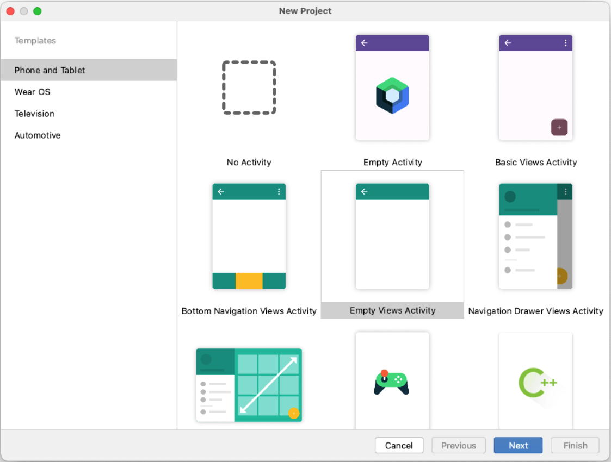
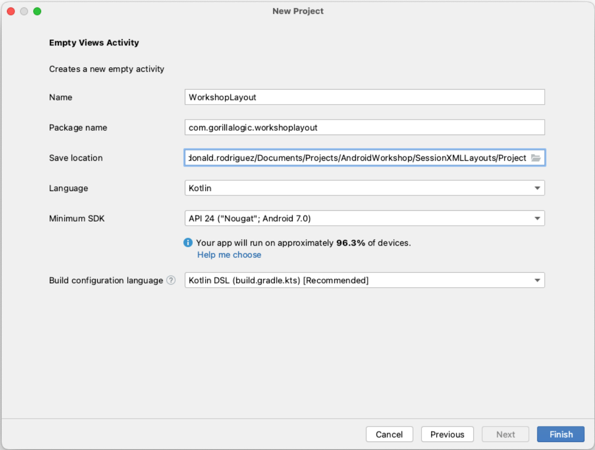

# Android Development from Scratch Xml Layout Workshop

Welcome to the first session of the Android Development from scratch workshop.

In this session you will learn how to create applications from screatch using `Android Studio` with `Xml Layout`.

---

# Table of contents

1. [Preparation](#Preparation)
    - [Download and Install Android Studio](#download-and-install-android-studio)
    - [Create new project](#create-new-project)
1. 

---

# Preparation

## Download and Install Android Studio

Go to the download link at <a href="https://developer.android.com/studio" target="_blank">Android Studio</a> and follow the instructions to download and install `Android Studio` on your computer.

## Create new project

1. Open Android Studio, the new project template is shown.
Select *`Empty Views Activity`* from the *`Phone and Tablet`* templates and select *`Next`*

 

2. In the New project screen, set the properties to:

| **Property** | **Value**     |
| ----------|-----------------|
| Name     |  WorkshopLayout        |
| Package     |  com.gorillalogic.workshoplayout        |
| Save Location     |  Select a folder of your preference        |
| Language     |  Kotlin        |

Let the `Minimum SDK` and the `build configuration` with the default values.
Select `Finish` and wait until the project is created and configured by `Android Studio`.

---

