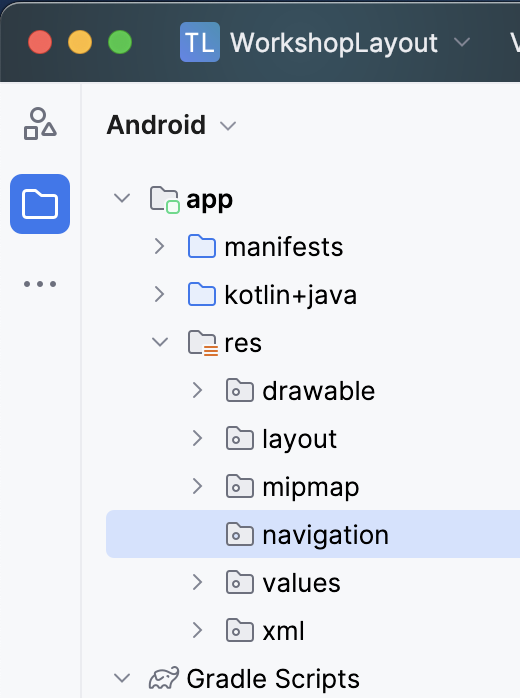
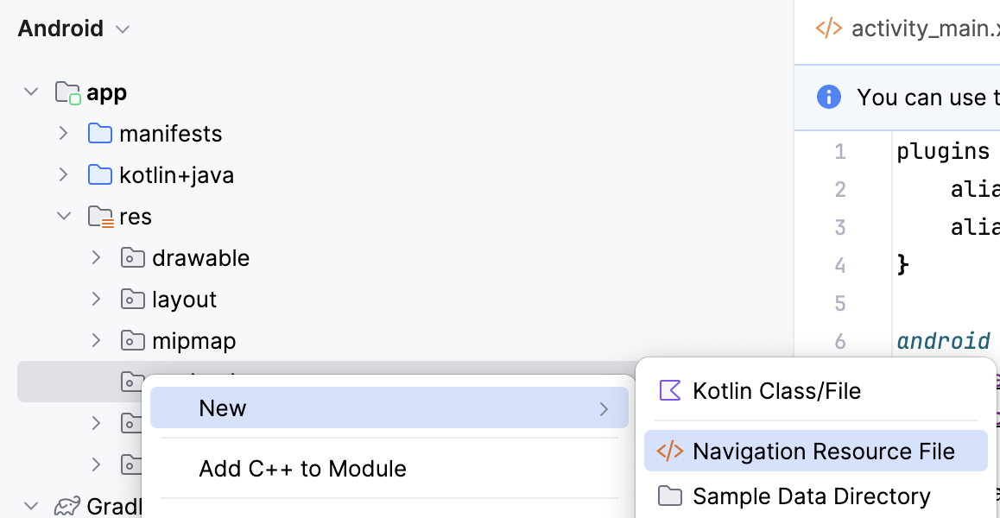
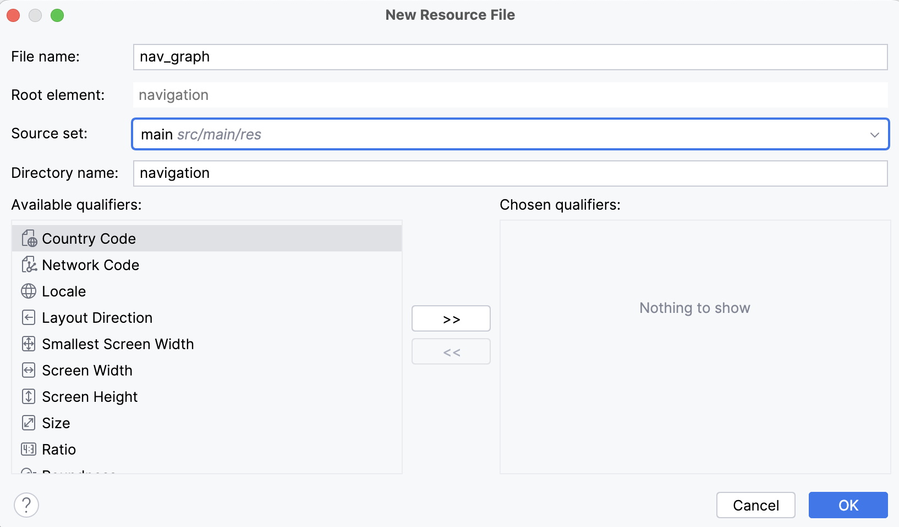
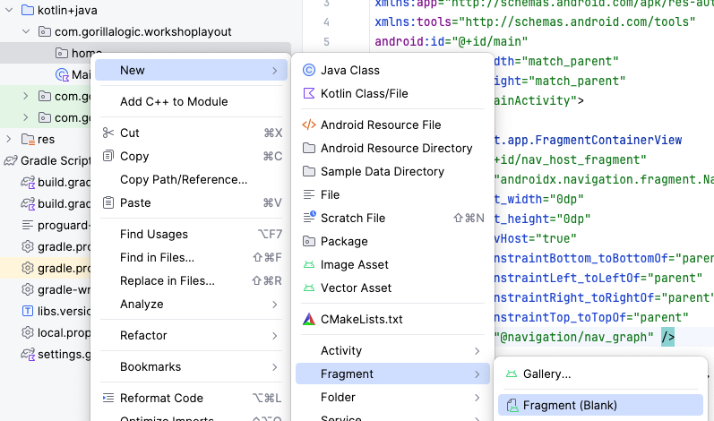
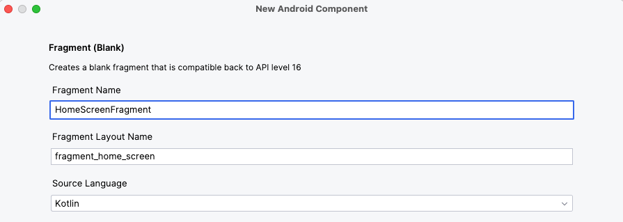
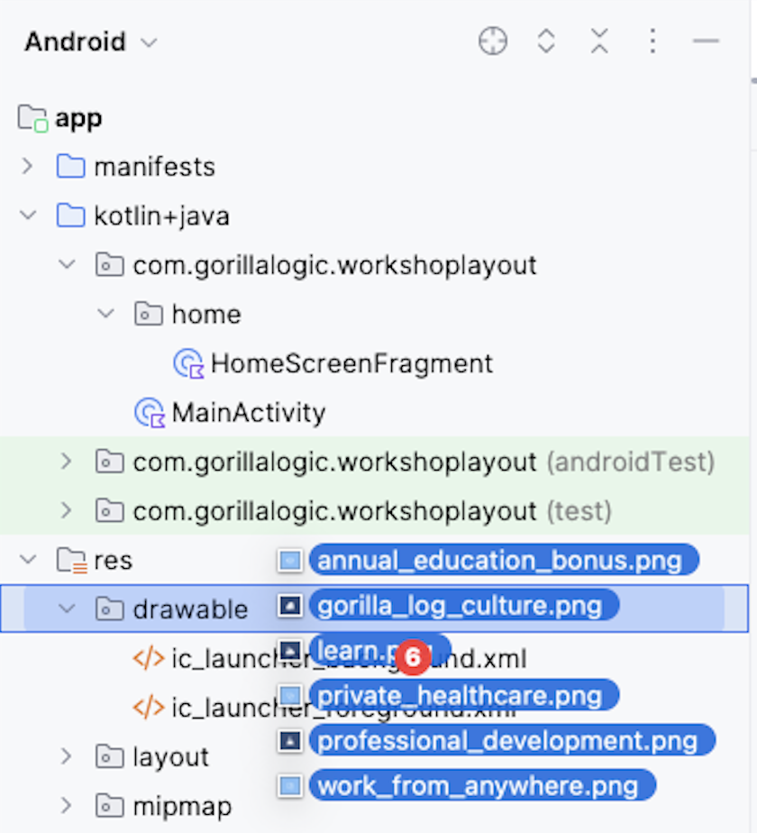
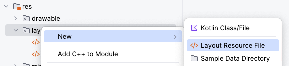
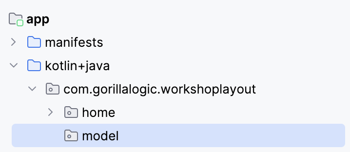
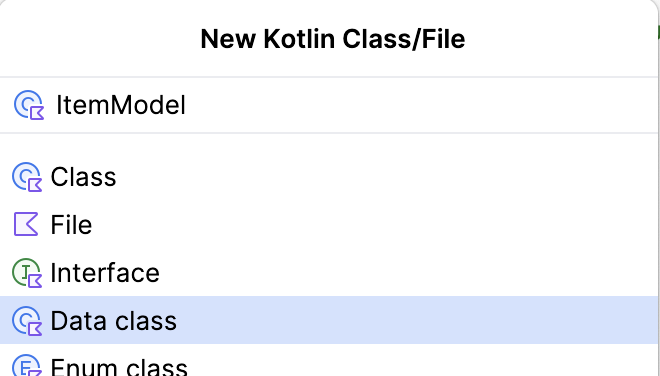

# Android Development from Scratch Xml Layout Workshop

Welcome to the first session of the Android Development from scratch workshop.

In this session you will learn how to create applications from scratch using `Android Studio` with `Xml Layout`.

---

# Table of contents

1. [Project review](docs/project-review.mdx)
    - [Design and requirements](docs/project-review.mdx#desing-and-requirements)
    - [MVVM design pattern](docs/project-review.mdx#mvvm-design-pattern)
1. [Environment preparation](docs/environment-preparation.mdx)
    - [Download and install Android Studio](docs/environment-preparation.mdx#download-and-install-android-studio)
    - [Create new project](docs/environment-preparation.mdx#create-new-project)
1. [Create Main Screen](#create-main-screen)
    - [Activity and Fragment](#activity-and-fragment)
    - [Layouts](#layouts)
    - [Jetpack Navigation Component](#jetpack-navigation-component)
        - [Add libraries](#add-libraries)
        - [Navigation Graph](#navigation-graph)
        - [NavHost](#navhost)
        - [NavController](#navcontroller)
    - RecyclerView
        - ViewHolder
        - Adapter
1. Data model
    - ViewModel
        - Data source
        - Repository
        - Implementation
    - View Binding
    - Data Binding
        - Implementation
        - Binding adapters
1. Details screen
    - Add detail screen to the navigation

---

# Create Main Screen

Before we start creating the main screen, we need to review what an `Activity` and a `Fragment` are in Android.

## Activity and Fragment

The `Activity` is a class designed to be the main point to start an Android application. It is the visual component that holds the UI and handle the communication with the users. We will have just one `Activity` in our workshop project.
For more information, check the official documentation at <a href="https://developer.android.com/guide/components/activities/intro-activities" target="_blank">Activities</a>.

The `Fragment` represents a reusable portion of the user interface, it defines and manages its own layout. `Fragments` must be hosted by and `Activity` or another `Fragment`. 
For this workshop, we will create two fragments for each of the screens `Main` and `Details` screens.

For more information, check the official documentation at <a href="https://developer.android.com/guide/fragments" target="_blank">Fragments</a>.

## Layouts

A Layout is a `ViewGroup` designed to hold more items and organize them according to rules added to their children.
In Android, we have different layouts to create amazing user interfaces:

#### FrameLayout

Designed to block out an area on the screen to display a single item.

#### LinearLayout

Arranges other views either horizontally in a single column or vertically in a single row.

#### RelativeLayout

The positions of the children can be described in relation to each other or to the parent.

#### ConstraintLayout

Allows you to position and size widgets in a flexible way.

For more information, check the official documentation at <a href="https://developer.android.com/develop/ui/views/layout/declaring-layout" target="_blank">Layouts</a>.

## Jetpack Navigation Component

It is a jetpack component that help us organize and manage the navigation between screens in our app.

For more information, check the official documentation at <a href="https://developer.android.com/guide/navigation" target="_blank">Jetpack Navigation Component</a>.

### Add Libraries

1. In `build.gradle.kts` (Module: `app`), add these three lines of code, right before `testImplementation(..)` and `sync` Gradle.
</br>

    ```kotlin
    // Navigation
    implementation("androidx.navigation:navigation-fragment-ktx:2.7.7")
    implementation("androidx.navigation:navigation-ui-ktx:2.7.7")
    ```

### Navigation Graph

It is an XML resource that contains all navigation-related information in one centralized location. This includes all of the individual content areas within your app, called destinations, as well as the possible paths that a user can take through your app.

1. Create new `navigation` folder into `resources (res folder)`
    <br/>
    
    <br/>

1. Create new `navigation resource` file into the `navigation` folder and name it `nav_graph`
    <br/>
    
    <br/>
    
    <br/>
    

### NavHost

It is an empty container that displays destinations from your navigation graph. The `Navigation` component contains a default `NavHost` implementation, `NavHostFragment`, that displays fragment destinations.

1. To setup the `NavHost`, in `activity_main.xml`, replace the `TextView` implementation with this code:

    ```xml
    <androidx.fragment.app.FragmentContainerView
        android:id="@+id/nav_host_fragment"
        android:name="androidx.navigation.fragment.NavHostFragment"
        android:layout_width="0dp"
        android:layout_height="0dp"
        app:defaultNavHost="true"
        app:layout_constraintBottom_toBottomOf="parent"
        app:layout_constraintLeft_toLeftOf="parent"
        app:layout_constraintRight_toRightOf="parent"
        app:layout_constraintTop_toTopOf="parent"
        app:navGraph="@navigation/nav_graph" />

    ```

### NavController

It is an object that manages app navigation within a `NavHost`. The `NavController` orchestrates the swapping of destination content in the `NavHost` as users move throughout your app.

Let's add the first `Fragment` to the project, the `home screen`:

1. Create new `package` with the name `com.gorillalogic.workshoplayout.home`:
    <br/>
    
    <br/>
1. Inside the new `package`, create a new `blank fragment` and set the name to `HomeScreenFragment`:
    <br/>
    
    <br/>
    
    <br/>
1. Replace the code in `HomeScreenFragment` with this code and `organize imports` pressing `Ctrl + o`:

    ```kotlin
    package com.gorillalogic.workshoplayout.home

    class HomeScreenFragment : Fragment() {
        
        override fun onCreateView(
            inflater: LayoutInflater,
            container: ViewGroup?,
            savedInstanceState: Bundle?
        ): View? {
            // Inflate the layout for this fragment
            return inflater.inflate(
                R.layout.fragment_home_screen, container, false
            )
        }
    }
    ```

1. Run and test the application

## RecyclerView

`RecyclerView` is a class that help us to create list of data. The `RecyclerView` library dynamically creates the elements when they're needed, making it very efficient and scalable.

For more information, check the official documentation at <a href="https://developer.android.com/develop/ui/views/layout/recyclerview" target="_blank">RecyclerView</a>. 

### ViewHolder

Each individual element in the list is defined by a` view holder` object. When the `view holder` is created, it doesn’t have any data associated with it. After the `view holder` is created, the `RecyclerView` binds it to its data.
You define the `view holder` by extending `RecyclerView.ViewHolder`.

Add list item view holder:

1. Import images to project:
Download and extract the contents of the <a href="docs/images/images.zip" target="_blank">images.zip</a> file. Copy the images to the `drawable` folder, select refactor in the popup alert that appears.
    <br/>
    
    <br/>

1. Create new `Layout` for the home list item:
    <br/>
    
    <br/>
    
    <br/>

1. Replace the contents of the `home_item.xml` file with this code:

    ```xml
    <?xml version="1.0" encoding="utf-8"?>
    <LinearLayout xmlns:android="http://schemas.android.com/apk/res/android"
        xmlns:tools="http://schemas.android.com/tools"
        android:layout_width="match_parent"
        android:layout_height="wrap_content"
        android:layout_marginHorizontal="16dp"
        android:layout_marginVertical="4dp"
        android:orientation="vertical">

        <LinearLayout
            android:layout_width="match_parent"
            android:layout_height="wrap_content"
            android:orientation="horizontal">

            <ImageView
                android:id="@+id/item_image"
                android:layout_width="100dp"
                android:layout_height="87dp"
                android:layout_gravity="center_vertical"
                tools:src="@drawable/annual_education_bonus" />

            <LinearLayout
                android:layout_width="wrap_content"
                android:layout_height="wrap_content"
                android:orientation="vertical">

                <TextView
                    android:id="@+id/item_title"
                    android:layout_width="wrap_content"
                    android:layout_height="wrap_content"
                    android:layout_marginHorizontal="8dp"
                    android:textAppearance="?attr/textAppearanceHeadline5"
                    tools:text="Annual education bonus" />

                <TextView
                    android:id="@+id/item_description"
                    android:layout_width="wrap_content"
                    android:layout_height="wrap_content"
                    android:layout_marginHorizontal="8dp"
                    android:textAppearance="?attr/textAppearanceBody1"
                    tools:text="Support your growth in your field with a $1,000 USD annual education benefit that can be used for courses, books, and conferences." />

            </LinearLayout>

        </LinearLayout>

        <com.google.android.material.divider.MaterialDivider
            android:layout_width="match_parent"
            android:layout_height="1dp"
            android:layout_marginTop="4dp" />

    </LinearLayout>

    ```

1. In `fragment_home_screen.xml`, add the app `namespace`: 

    ```xml
    xmlns:app="http://schemas.android.com/apk/res-auto"
    ```

1. In the same file, replace the `TextView` implementation with this code:
    ```xml
    <androidx.recyclerview.widget.RecyclerView
        android:id="@+id/clients_recycler_view"
        android:layout_width="match_parent"
        android:layout_height="match_parent"
        android:scrollbars="vertical"
        app:layoutManager="androidx.recyclerview.widget.LinearLayoutManager"
        app:layout_constraintBottom_toBottomOf="parent"
        app:layout_constraintEnd_toEndOf="parent"
        app:layout_constraintStart_toStartOf="parent"
        app:layout_constraintTop_toTopOf="parent"
        tools:itemCount="20"
        tools:listitem="@layout/home_item" />
    ```
    Open the `preview` and you should see a temp list like this:

    <br/>
    
    <br/>

### Adapter

The `RecyclerView` requests views, and binds the views to their data, by calling methods in the `Adapter`. You define the `Adapter` by extending `RecyclerView.Adapter`.

Add home `Adapter`:

1. Create new package and name it `model`:
    <br/>
    
    <br/>

1. Inside the new `model` package, create a new model class with the name `ItemModel`:
    <br/>
    
    <br/>

1. Replace the content of the new `ItemModel` class with this code:

    ```kotlin
    package com.gorillalogic.workshoplayout.model

    data class ItemModel(
        val imageResourceId: Int,
        val titleId: Int,
        val descriptionId: Int
    )
    ```

1. Add the items list data to the project as static strings. Open the `strings.xml` file and add the following strings to it:

    ```xml
    <!-- Title data -->
    <string name="title_private_healthcare">PRIVATE HEALTHCARE</string>
    <string name="title_work_anywhere">WORK ANYWHERE</string>
    <string name="title_gorilla_logic_culture">GORILLA LOGIC CULTURE</string>
    <string name="title_professional_development">PROFESSIONAL DEVELOPMENT</string>
    <string name="title_learn">LEARN</string>
    <string name="title_annual_education_bonus">ANNUAL EDUCATION BONUS</string>

    <!-- Description data -->
    <string name="desc_private_healthcare">Take advantage of competitive private healthcare and life insurance offerings.</string>
    <string name="desc_work_anywhere">Work anywhere in your country of hire with our flexible Remote Work Policy.</string>
    <string name="desc_gorilla_logic_culture">Join a well-established culture, where there’s a place for everyone to connect regardless of their interests.</string>
    <string name="desc_professional_development">Feed your curious brain with professional development opportunities including Workshops, Bootcamps, and Udemy training.</string>
    <string name="desc_learn">Work with talented individuals on complex projects while sharing your knowledge and building your personal brand via blog posts, Lunch and Learns, and Tech Talks.</string>
    <string name="desc_annual_education_bonus">Support your growth in your field with a $1,000 USD annual education benefit that can be used for courses, books, and conferences.</string>
    ```

1. Add these `function` and `property` to the `companion object` of the `ItemModel` class to be able to create random items data for testing purposes:

    ```kotlin
    //region - Companion object
    companion object {
        // Create random list of items
        fun randomItems(): List<ItemModel> {
            val list = mutableListOf<ItemModel>()
            for (i in 1..10) {
                list.add(randomItem)
            }
            return list
        }
    }

    // Create a random item
    private val randomItem: ItemModel
        get() {
            val images = listOf(
                R.drawable.annual_education_bonus,
                R.drawable.work_from_anywhere,
                R.drawable.gorilla_log_culture,
                R.drawable.professional_development,
                R.drawable.learn,
                R.drawable.annual_education_bonus
            )
            val titles = listOf(
                R.string.title_private_healthcare,
                R.string.title_work_anywhere,
                R.string.title_gorilla_logic_culture,
                R.string.title_professional_development,
                R.string.title_learn,
                R.string.title_annual_education_bonus
            )
            val descriptions = listOf(
                R.string.desc_private_healthcare,
                R.string.desc_work_anywhere,
                R.string.desc_gorilla_logic_culture,
                R.string.desc_professional_development,
                R.string.desc_learn,
                R.string.desc_annual_education_bonus
            )
            return ItemModel(
                images.random(),
                titles.random(),
                descriptions.random()
            )
        }
    ```

1. Create new kotlin class inside the `home` package and name it `HomeAdapter`:
    <br/>
    
    <br/>

1. Replace the class definition with:
    ```kotlin
    class HomeAdapter(private val listener: (ItemModel) -> Unit) : ListAdapter<ItemModel, RecyclerView.ViewHolder>(HomeAdapterDiffCallback) {
    ```
1. Add the `view holder` definition inside the adapter class:
    
    ```kotlin
    //region - View Holder
    class HomeItemViewHolder(private var parent: View) : RecyclerView.ViewHolder(parent) {

        // Get reference to UI views
        private val itemImageView: ImageView = parent.findViewById(R.id.item_image)
        private val itemTitleView: TextView = parent.findViewById(R.id.item_title)
        private val descriptionView: TextView = parent.findViewById(R.id.item_description)

        // Bind data with views
        fun bind(item: ItemModel, listener: (ItemModel) -> Unit) {
            parent.setOnClickListener { listener(item) }
            itemImageView.setImageResource(item.imageResourceId)
            itemTitleView.setText(item.titleId)
            descriptionView.setText(item.descriptionId)
        }
    }
    //endregion
    ```
1. Add `ListAdapter` implementation inside the `adapter` class:
    ```kotlin
    //region - ListAdapter implementation
    override fun onCreateViewHolder(parent: ViewGroup, viewType: Int): RecyclerView.ViewHolder {
        val itemView = LayoutInflater
            .from(parent.context)
            .inflate(R.layout.home_item, parent, false)
        return HomeItemViewHolder(itemView)
    }

    override fun onBindViewHolder(holder: RecyclerView.ViewHolder, position: Int) {
        val itemData = getItem(position)
        (holder as HomeItemViewHolder).bind(itemData, listener)
    }
    //endregion
    ```

1. Add the `DiffCallback` implementation inside the `Adapter` class:
    ```kotlin
    //region - Companion DiffCallback implementation
    companion object HomeAdapterDiffCallback : DiffUtil.ItemCallback<ItemModel>() {

        override fun areItemsTheSame(oldItem: ItemModel, newItem: ItemModel): Boolean {
            return oldItem.imageResourceId == newItem.imageResourceId &&
                   oldItem.titleId == newItem.titleId &&
                   oldItem.descriptionId == newItem.descriptionId
        }

        override fun areContentsTheSame(oldItem: ItemModel, newItem: ItemModel): Boolean {
            return oldItem.imageResourceId == newItem.imageResourceId &&
                   oldItem.titleId == newItem.titleId &&
                   oldItem.descriptionId == newItem.descriptionId
        }
    }
    //endregion
    ```


