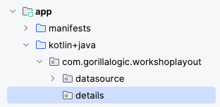
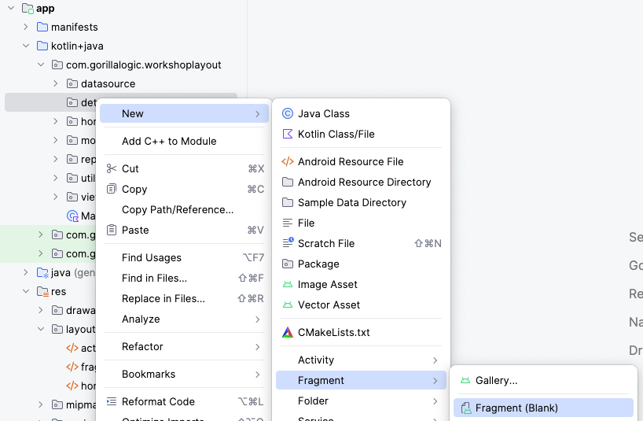
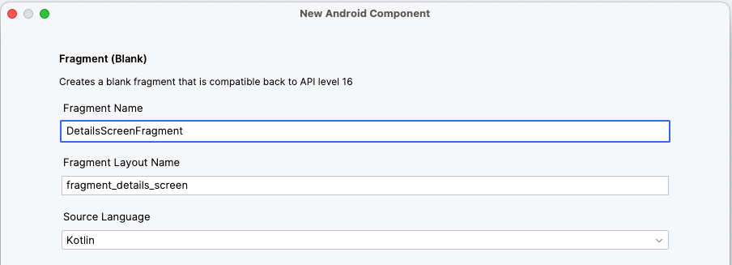
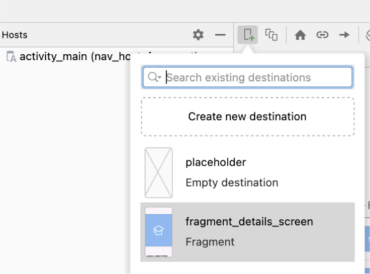
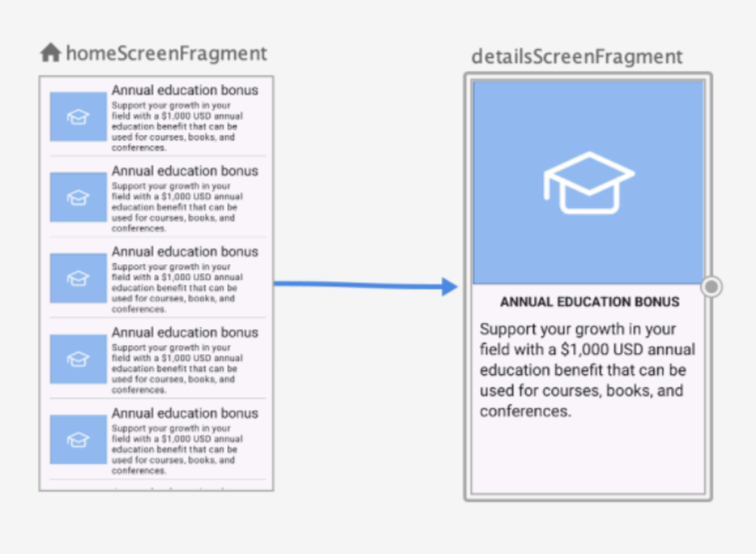
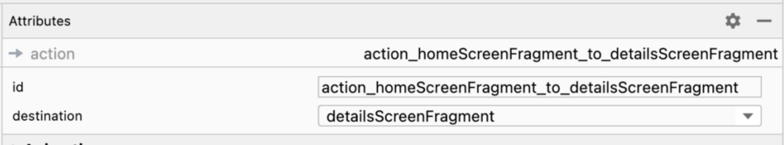

# 5. Details Screen

In this last section of the workshop, we will create a new screen to show the details of an item when is selected from the home screen.
We will use jetpack navigation component to display this new screen when the item is selected.

1. Create new `package` and name if `details`
    <br/>
    <br/>
    
    <br/>

1. Create a new `blank fragment` inside the `details` package and name it `DetailsScreenFragment`:
    <br/>
    <br/>
    
    <br/>
    
    <br/>

1. Open the layout file `fragment_details_screen.xml` and replace the content with this `xml`:

    ```xml
    <?xml version="1.0" encoding="utf-8"?>
    <layout xmlns:android="http://schemas.android.com/apk/res/android"
        xmlns:app="http://schemas.android.com/apk/res-auto"
        xmlns:tools="http://schemas.android.com/tools"
        tools:context=".details.DetailsScreenFragment">
        
        <data>
            <variable
                name="selectedItem"
                type="com.gorillalogic.workshoplayout.model.ItemModel" />
        </data>

        <androidx.constraintlayout.widget.ConstraintLayout
            android:layout_width="match_parent"
            android:layout_height="match_parent">
            
            <ImageView
                android:id="@+id/item_image"
                android:layout_width="wrap_content"
                android:layout_height="wrap_content"
                app:itemImage="@{selectedItem.imageResourceId}"
                app:layout_constraintEnd_toEndOf="parent"
                app:layout_constraintStart_toStartOf="parent"
                app:layout_constraintTop_toTopOf="parent"
                tools:src="@drawable/annual_education_bonus" />
            
            <TextView
                android:id="@+id/item_title"
                android:layout_width="wrap_content"
                android:layout_height="wrap_content"
                android:layout_marginVertical="12dp"
                android:paddingHorizontal="12dp"
                android:textAllCaps="true"
                android:textAppearance="?attr/textAppearanceHeadline5"
                android:textStyle="bold"
                app:itemTitle="@{selectedItem.titleId}"
                app:layout_constraintEnd_toEndOf="parent"
                app:layout_constraintStart_toStartOf="parent"
                app:layout_constraintTop_toBottomOf="@+id/item_image"
                tools:text="Annual education bonus" />
            
            <TextView
                android:id="@+id/item_description"
                android:layout_width="wrap_content"
                android:layout_height="wrap_content"
                android:layout_marginVertical="12dp"
                android:paddingHorizontal="12dp"
                android:textAppearance="?attr/textAppearanceHeadlineMedium"
                app:itemDescription="@{selectedItem.descriptionId}"
                app:layout_constraintEnd_toEndOf="parent"
                app:layout_constraintStart_toStartOf="parent"
                app:layout_constraintTop_toBottomOf="@+id/item_title"
                tools:text="Support your growth in your field with a $1,000 USD annual education benefit that can be used for courses, books, and conferences." />
        
        </androidx.constraintlayout.widget.ConstraintLayout>
    
    </layout>
    ```

1. Now, open the source code file `DetailsScreenFragment.kt` and replace the contents of it with the next code:

    ```kotlin
    package com.gorillalogic.workshoplayout.details

    import android.os.Bundle
    import androidx.fragment.app.Fragment
    import android.view.LayoutInflater
    import android.view.View
    import android.view.ViewGroup
    import androidx.fragment.app.activityViewModels
    import com.gorillalogic.workshoplayout.databinding.FragmentDetailsScreenBinding
    import com.gorillalogic.workshoplayout.view_model.ItemsViewModel

    class DetailsScreenFragment : Fragment() {
        
        //region - Properties
        private val itemsViewModel: ItemsViewModel by activityViewModels()
        //endregion

        override fun onCreateView(
            inflater: LayoutInflater,
            container: ViewGroup?,
            savedInstanceState: Bundle?
        ): View {
            // Inflate the layout for this fragment
            val frameBinding = FragmentDetailsScreenBinding.inflate(inflater, container, false)
            frameBinding.apply {
                // Allows Data Binding to Observe LiveData with the lifecycle of this Fragment
                lifecycleOwner = viewLifecycleOwner
                // Giving the binding access to the ViewModel
                selectedItem = itemsViewModel.selectedItem.value
            }
            return frameBinding.root
        }
    }
    ```

1. Open the file `BindingAdapter.kt` and add three new adapters for the image, title and description of the item:

    ```kotlin
    @BindingAdapter("itemImage")
    fun bindItemImage(imageView: ImageView, resourceId: Int) {
        imageView.setImageResource(resourceId)
    }
    
    @BindingAdapter("itemTitle")
    fun bindItemTitle(textView: TextView, resourceId: Int) {
        textView.text = textView.resources.getString(resourceId)
    }
    
    @BindingAdapter("itemDescription")
    fun bindItemDescription(textView: TextView, resourceId: Int) {
        textView.text = textView.resources.getString(resourceId)
    }
    ```

    You also need to add these three imports at the top of the file:
    ```kotlin
    import android.widget.ImageView
    import android.widget.TextView
    ```

1. Open the `HomeScreenFragment.kt` and add this code inside the home adapter listener, right after the `Log.d` instruction. 
With this code, we are updating the selected item data in the view model, so we will be able to access it from the details screen.
    ```kotlin
    Log.d("HomeScreenFragment", "Item Selected ${getString(it.titleId)}")
    // Update selected item in the view model
    itemsViewModel.updateSelectedItem(it)
    ```

## Add detail screen to the navigation

It is time to navigate to the details screen to show the details of the selected item:

1. Open the `nav_graph.xml` file and add the details screen:
    <br/>
    <br/>
    
    <br/>

1. Still in `nav_graph`, create a connection between the `home screen` and the `details screen`
    <br/>
    <br/>
    
    <br/>

1. In the properties of the connection you can see the `id` of it, select and copy it, you will need it to trigger the navigation from the `main screen`
    <br/>
    <br/>
    
    <br/>

1. Open the `HomeScreenFragment.kt` and add this code to navigate to the details screen, right after the last instruction you added to update the selected item:
    ```kotlin
    // Update selected item in the view model
    itemsViewModel.updateSelectedItem(it)
    // Navigate to details screen
    findNavController().navigate(R.id.action_homeScreenFragment_to_detailsScreenFragment)
    ```

1. Run and test the app, you should be able to select an item from the main screen and the app will navigate to the details screen showing the selected item data.
