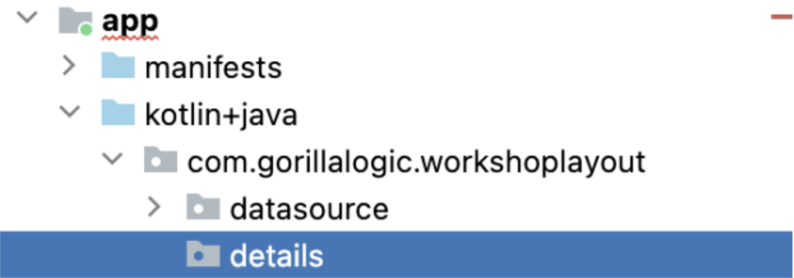

# 5. Details Screen

This screen will show the information of the selected itemfrom the main screen.

1. Create new `package` and name if `details`
    <br/>
    
    <br/>

1. Create a new `blank fragment` inside the `details package` and name it `DetailsScreenFragment` and replace the code with this:

    ```kotlin
    class DetailsScreenFragment : Fragment() {
        //region - Properties
        private val itemsViewModel: ItemsViewModel by activityViewModels()
        //endregion
        
        override fun onCreateView(
            inflater: LayoutInflater,
            container: ViewGroup?,
            savedInstanceState: Bundle?
        ): View {
            // Inflate the layout for this fragment
            val frameBinding = FragmentDetailsScreenBinding.inflate(inflater, container, false)
            frameBinding.apply {
                // Allows Data Binding to Observe LiveData with the lifecycle of this Fragment
                lifecycleOwner = viewLifecycleOwner
                // Giving the binding access to the ViewModel
                selectedItem = itemsViewModel.selectedItem.value
            }
            return frameBinding.root
        }
    }
    ```

1. Open the layout file `fragment_details_screen.xml` and replace the content with this `xml`:

    ```xml
    <?xml version="1.0" encoding="utf-8"?>
    <layout xmlns:android="http://schemas.android.com/apk/res/android"
        xmlns:app="http://schemas.android.com/apk/res-auto"
        xmlns:tools="http://schemas.android.com/tools"
        tools:context=".details.DetailsScreenFragment">
        
        <data>
            <variable
                name="selectedItem"
                type="com.gorillalogic.workshoplayout.model.ItemModel" />
        </data>

        <androidx.constraintlayout.widget.ConstraintLayout
            android:layout_width="match_parent"
            android:layout_height="match_parent">
            
            <ImageView
                android:id="@+id/item_image"
                android:layout_width="wrap_content"
                android:layout_height="wrap_content"
                app:itemImage="@{selectedItem.imageResourceId}"
                app:layout_constraintEnd_toEndOf="parent"
                app:layout_constraintStart_toStartOf="parent"
                app:layout_constraintTop_toTopOf="parent"
                tools:src="@drawable/annual_education_bonus" />
            
            <TextView
                android:id="@+id/item_title"
                android:layout_width="wrap_content"
                android:layout_height="wrap_content"
                android:layout_marginVertical="12dp"
                android:paddingHorizontal="12dp"
                android:textAllCaps="true"
                android:textAppearance="?attr/textAppearanceHeadline5"
                android:textStyle="bold"
                app:itemTitle="@{selectedItem.titleId}"
                app:layout_constraintEnd_toEndOf="parent"
                app:layout_constraintStart_toStartOf="parent"
                app:layout_constraintTop_toBottomOf="@+id/item_image"
                tools:text="Annual education bonus" />
            
            <TextView
                android:id="@+id/item_description"
                android:layout_width="wrap_content"
                android:layout_height="wrap_content"
                android:layout_marginVertical="12dp"
                android:paddingHorizontal="12dp"
                android:textAppearance="?attr/textAppearanceHeadlineMedium"
                app:itemDescription="@{selectedItem.descriptionId}"
                app:layout_constraintEnd_toEndOf="parent"
                app:layout_constraintStart_toStartOf="parent"
                app:layout_constraintTop_toBottomOf="@+id/item_title"
                tools:text="Support your growth in your field with a $1,000 USD annual education benefit that can be used for courses, books, and conferences." />
        
        </androidx.constraintlayout.widget.ConstraintLayout>
    
    </layout>
    ```

1. Open the file `BindingAdapter.kt` and add three new adapters for the image, title and
description of the item:

    ```kotlin
    @BindingAdapter("itemImage")
    fun bindItemImage(imageView: ImageView, resourceId: Int) {
        imageView.setImageResource(resourceId)
    }
    
    @BindingAdapter("itemTitle")
    fun bindItemTitle(textView: TextView, resourceId: Int) {
        textView.text = textView.resources.getString(resourceId)
    }
    
    @BindingAdapter("itemDescription")
    fun bindItemDescription(textView: TextView, resourceId: Int) {
        textView.text = textView.resources.getString(resourceId)
    }
    ```

1. Open the file `ItemsViewModel.kt` and add a property for the selected item:
    
    ```kotlin
    // Store the selected item data
    private val _selectedItem = MutableLiveData<ItemModel>()
    val selectedItem: LiveData<ItemModel> = _selectedItem
    ```

1. Also add a function to update the selected item:

    ```kotlin
    fun updateSelectedItem(item: ItemModel) {
        _selectedItem.value = item
    }
    ```

1. Open the `HomeScreenFragment.kt` and add this code inside the home adapter listener:
    ```kotlin
    // Update selected item in the view model
    itemsViewModel.updateSelectedItem(it)
    ```

## Add detail screen to the navigation

1. Open the `nav_graph.xml` file and add the details screen:
    <br/>
    
    <br/>

1. Still in `nav_graph`, create a connection between the `home screen` and the `details screen`
    <br/>
    
    <br/>

1. In the properties of the connection you can see the `id` of it, select and copy it, you will need it to trigger the navigation from the `main screen`
    <br/>
    
    <br/>

1. Open the `HomeScreenFragment.kt` and add this code to navigate to the details screen:
    ```kotlin
    // Navigate to details screen
    findNavController().navigate(R.id.action_homeScreenFragment_to_detailsScreenFragment)
    ```