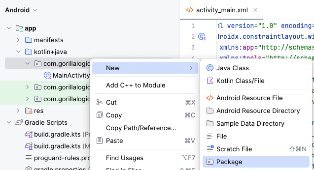
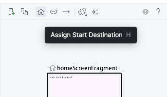
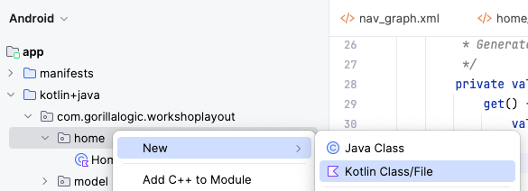

# 3. Create Main Screen

Before we start creating the main screen, we need to review what an `Activity` and a `Fragment` are in Android.

## Activity and Fragment

The `Activity` is a class designed to be the main point to start an Android application. It is the visual component that holds the UI and handle the communication with the users. We will have just one `Activity` in our workshop project.

For more information, check the official documentation at <a href="https://developer.android.com/guide/components/activities/intro-activities" target="_blank">Activities</a>.

The `Fragment` represents a reusable portion of the user interface, it defines and manages its own layout. `Fragments` must be hosted by and `Activity` or another `Fragment`. 
For this workshop, we will create two fragments for each of the screens `Main` and `Details` screens.

For more information, check the official documentation at <a href="https://developer.android.com/guide/fragments" target="_blank">Fragments</a>.

## Layouts

A Layout is a `ViewGroup` designed to hold more items and organize them according to rules added to their children.
In Android, we have different layouts to create amazing user interfaces:

#### FrameLayout

Designed to block out an area on the screen to display a single item.

#### LinearLayout

Arranges other views either horizontally in a single column or vertically in a single row.

#### RelativeLayout

The positions of the children can be described in relation to each other or to the parent.

#### ConstraintLayout

Allows you to position and size widgets in a flexible way.

For more information, check the official documentation at <a href="https://developer.android.com/develop/ui/views/layout/declaring-layout" target="_blank">Layouts</a>.

## Jetpack Navigation Component

This component help us organize and manage the navigation between screens (fragments) in our app.
For this workshop we will use it to handle the navigation between the main and details screens.

For more information, check the official documentation at <a href="https://developer.android.com/guide/navigation" target="_blank">Jetpack Navigation Component</a>.

Let's add the navigation component to our project:

### Add Libraries

In order to be able to use the navigation component, we need to add the library as a dependency to the project. For this work, we have a Graddle file that handle all those dependencies and configure them for our project.

Each module have his own graddle file, a Android project may have several modules. In out case, we only have one module, the main app.

Let's add the `jetpack navigation` libraries to our graddle module file:

1. Open the `build.gradle.kts` file:
    <br/>
    
    <br/>

1. Add these three lines of code inside the `dependencies` section, right before `testImplementation(..)`.
    ```kotlin
    dependencies {
        ...

        // Navigation
        implementation("androidx.navigation:navigation-fragment-ktx:2.7.7")
        implementation("androidx.navigation:navigation-ui-ktx:2.7.7")

        testImplementation(libs.junit)
        ...
    }
    ```
1. Now, we need to sync gradle dependencies, it will download required libraries (source coee) and sync the project with them. Use the `Sync Now` button at the top right of the gradle file editor
    <br/>
    
    <br/>

### Navigation Graph

It is an XML resource that contains all navigation-related information in one centralized location. This includes all of the individual content areas within your app, called destinations, as well as the possible paths that a user can take through your app.

We will create two destinations in our navigation graph, for now, let's add the main screen, later we will add the details screen.

1. Create new `navigation` folder into `resources (res folder)`
    <br/>
    
    <br/>

1. Create new `navigation resource` file into the `navigation` folder and name it `nav_graph`
    <br/>
    
    <br/>
    
    <br/>

### NavHost

It is an empty container that displays destinations from your navigation graph. 
The `Navigation` component contains a default `NavHost` implementation, `NavHostFragment`, that displays fragment destinations.

Let's add the nav host for our project:

1. The main `Activity` of the project is named `MainActivity`, the layout for this activity is named `activity_main.xml`. 
To setup the `NavHost`, open `activity_main.xml` that is located at the folder `res/layout/activity_main.xml`
<br/>

<br/>

1. Open that file and in the right side, select to `split` the `code` and `layout` of the xml. That will let you see the code and the design at the same time.
Right now you should see the `Hello World` text view at the center of the screen.
<br/>

<br/>

1. Now, let's set the activity main entry point a `FragmentContainerView`, and associate it with the `nav graph` that we already created.
That means the application will use the `nav_graph` we created as the main source of navigation of the app. Any fragment the app will manipulate, should be inside the nav_graph file.
Let's replace the `TextView` with this code:

    ```xml
    <androidx.fragment.app.FragmentContainerView
        android:id="@+id/nav_host_fragment"
        android:name="androidx.navigation.fragment.NavHostFragment"
        android:layout_width="0dp"
        android:layout_height="0dp"
        app:defaultNavHost="true"
        app:layout_constraintBottom_toBottomOf="parent"
        app:layout_constraintLeft_toLeftOf="parent"
        app:layout_constraintRight_toRightOf="parent"
        app:layout_constraintTop_toTopOf="parent"
        app:navGraph="@navigation/nav_graph" />
    ```

### NavController

It is an object that manages app navigation within a `NavHost`. The `NavController` orchestrates the swapping of destination content in the `NavHost` as users move throughout your app.

Let's add the first `Fragment` to the project, the `Main Screen`:

1. Create new `package` with the name `com.gorillalogic.workshoplayout.home`:
    <br/>
    
    
    <br/>
1. Inside the new `home package`, create a new `blank fragment` and set the name to `HomeScreenFragment`:
    <br/>
    
    <br/>
    
    <br/>
    As you can see, you will create two new files: 
    - `HomeScreenFragment.kt`: This contains all the kotlin source code, and is responsible to handle the life cycle of the fragment and to inflate the UI.
    - `fragment_home_screen.xml`: This file contains the design of the fragment. This file is used by the fragment to present the UI to the user and interact with him.

1. Now, open the source code file `HomeScreenFragment.kt` and replace the contents of it with the next code. It is simply overriding the `onCreatedView` method to `inflate` the layout and assign it as the view of the `Fragment`

    ```kotlin
    package com.gorillalogic.workshoplayout.home

    import android.os.Bundle
    import android.view.LayoutInflater
    import android.view.View
    import android.view.ViewGroup
    import androidx.fragment.app.Fragment
    import com.gorillalogic.workshoplayout.R

    class HomeScreenFragment : Fragment() {

        override fun onCreateView(
            inflater: LayoutInflater,
            container: ViewGroup?,
            savedInstanceState: Bundle?
        ): View? {
            // Inflate the layout for this fragment
            return inflater.inflate(
                R.layout.fragment_home_screen, container, false
            )
        }
    }
    ```

1. Now we need to add the new `main screen` to the `nav_graph` so the application knows what is the main destination to show first.
Open `nav_graph.xml` from the navigation folder and select to add a `new destination`, the button is located at the top left:
    <br/>
    
    <br/>

1. Now select the `fragment_home_screen` from the list of destinations:
    <br/>
    
    <br/>

1. Make sure to set the `fragment_home_screen` as the start destination using the `home` icon button at the top, next to the `new destination` button
    <br/>
    
    <br/>

1. At the end, the `nav_graph` design should looks like this:
    <br/>
    
    <br/>

1. Run and test the application, you should see no errors and the default `Hello black fragment` on the screen.

## RecyclerView

`RecyclerView` is a class that help us to create and handle a list of data, it dynamically creates the elements when they're needed, making it very efficient and scalable.

For more information, check the official documentation at <a href="https://developer.android.com/develop/ui/views/layout/recyclerview" target="_blank">RecyclerView</a>. 

We will use a `RecyclerView` in our main fragment to show the list of items.

### ViewHolder

Each individual element in the list is defined by a `view holder` object. When the `view holder` is created, it doesn’t have any data associated with it. 
The `RecyclerView` binds the data to the `view holder` once it is created or reused.
You define the `view holder` by extending `RecyclerView.ViewHolder`.

We will start by creating the view holder for the items in the list:

1. First, we need to import the images that represent each one of the items to the project.
Download and extract the contents of the <a href="images.zip" target="_blank">images.zip</a> file. 
Copy the six images into the `res/drawable` folder in the project:
    <br/>
    
    <br/>

1. Select refactor in the popup alert that appears:
    <br/>
    
    <br/>

1. You should now have the six new images into the drawable folder:
    <br/>
    
    <br/>

1. Each one of the items, require a layout for the UI. Let's create a new `Layout Resource File` for the home list item into the `layout` folder:
    <br/>
    
    <br/>

1. Set the name to `home_item`, leave the rest as it is and select `OK`:
    <br/>
    
    <br/>

1. Replace the contents of the `home_item.xml` file with the next `xml`.
Remember to select `Split` from the top right options of the editor to see the `xml source code` next to the `preview` 

    ```xml
    <?xml version="1.0" encoding="utf-8"?>
    <LinearLayout xmlns:android="http://schemas.android.com/apk/res/android"
        xmlns:tools="http://schemas.android.com/tools"
        android:layout_width="match_parent"
        android:layout_height="wrap_content"
        android:layout_marginHorizontal="16dp"
        android:layout_marginVertical="4dp"
        android:orientation="vertical">

        <LinearLayout
            android:layout_width="match_parent"
            android:layout_height="wrap_content"
            android:orientation="horizontal">

            <ImageView
                android:id="@+id/item_image"
                android:layout_width="100dp"
                android:layout_height="87dp"
                android:layout_gravity="center_vertical"
                tools:src="@drawable/annual_education_bonus" />

            <LinearLayout
                android:layout_width="wrap_content"
                android:layout_height="wrap_content"
                android:orientation="vertical">

                <TextView
                    android:id="@+id/item_title"
                    android:layout_width="wrap_content"
                    android:layout_height="wrap_content"
                    android:layout_marginHorizontal="8dp"
                    android:textAppearance="?attr/textAppearanceHeadline5"
                    tools:text="Annual education bonus" />

                <TextView
                    android:id="@+id/item_description"
                    android:layout_width="wrap_content"
                    android:layout_height="wrap_content"
                    android:layout_marginHorizontal="8dp"
                    android:textAppearance="?attr/textAppearanceBody1"
                    tools:text="Support your growth in your field with a $1,000 USD annual education benefit that can be used for courses, books, and conferences." />

            </LinearLayout>

        </LinearLayout>

        <com.google.android.material.divider.MaterialDivider
            android:layout_width="match_parent"
            android:layout_height="1dp"
            android:layout_marginTop="4dp" />

    </LinearLayout>
    ```

    This `xml` creates the design for each of the items, you can see it defines the `image` with a reference of the `ImageView` and the `title` and `description` using `TextView`.
    It also set an id for each of the three elements: `item_image`, `item_title` and `item_description`, you will use them later to set the data.
    Is important to notice the `tools` namespace set default values for the `image`, `title` and `description` for testing porposes only, when you run the app, those values are ignored.
    Also, the design relies on `LinearLayout` to organize the items in the screen. At the end it should looks like:
    <br/>
    
    <br/>

1. Let's add the list in the home screen. Open `fragment_home_screen.xml`, add the app `namespace` to be able to add constraints to the layout: 

    ```kotlin
    xmlns:app="http://schemas.android.com/apk/res-auto"
    ```

1. Now, replace the `TextView` implementation with this code:
    ```xml
    <androidx.recyclerview.widget.RecyclerView
        android:id="@+id/clients_recycler_view"
        android:layout_width="match_parent"
        android:layout_height="match_parent"
        android:scrollbars="vertical"
        app:layoutManager="androidx.recyclerview.widget.LinearLayoutManager"
        app:layout_constraintBottom_toBottomOf="parent"
        app:layout_constraintEnd_toEndOf="parent"
        app:layout_constraintStart_toStartOf="parent"
        app:layout_constraintTop_toTopOf="parent"
        tools:itemCount="20"
        tools:listitem="@layout/home_item" />
    ```
    We are setting the id of the recycler view instance to `clients_recycler_view`, you will use it later.
    Also, we are using the `tools` namespace to set the `itemCount="20"` and `listitem`, this will show 20 instances of the home_item in the preview:
    <br/>
    
    <br/>

### Adapter

The `RecyclerView` requests views, and binds the views to their respective data by calling methods in the `Adapter`. You define the `Adapter` by extending `RecyclerView.Adapter`.

Let's add the `Adapter` for the home screen:

1. Create new package and name it `model`:
    <br/>
    
    <br/>

1. Inside the new `model` package, create a new `data class` with the name `ItemModel`:
    <br/>
    
    <br/>

1. Replace the content of the new `ItemModel` class with this code:

    ```kotlin
    package com.gorillalogic.workshoplayout.model

    data class ItemModel(
        val imageResourceId: Int,
        val titleId: Int,
        val descriptionId: Int
    )
    ```
    This class holds the data for each of the items in the home list (image, title and description). As you can see, the data is storing integers, instead of an actual image or strings. 
    Those integers, are references to the resources in the bundle of the application. The images are stored into the drawable folder, and are accessed using `R.drawable.`. To access the strings, you can use `R.strings.`
    This is useful for our project because we will use mock data to fill those values, and the mock data will be stored in the strings and drawable files.

1. To add the title and description of the items, open the strings resource file at `res/values/strings.xml`.
Inside the `<resources>` node, replace the placeholder:
    ```xml
    <!-- TODO: Remove or change this placeholder text -->
    <string name="hello_blank_fragment">Hello blank fragment</string>
    ```
     
     With the titles and descriptions:
    
    ```xml
    <!-- Title data -->
    <string name="title_private_healthcare">PRIVATE HEALTHCARE</string>
    <string name="title_work_anywhere">WORK ANYWHERE</string>
    <string name="title_gorilla_logic_culture">GORILLA LOGIC CULTURE</string>
    <string name="title_professional_development">PROFESSIONAL DEVELOPMENT</string>
    <string name="title_learn">LEARN</string>
    <string name="title_annual_education_bonus">ANNUAL EDUCATION BONUS</string>

    <!-- Description data -->
    <string name="desc_private_healthcare">Take advantage of competitive private healthcare and life insurance offerings.</string>
    <string name="desc_work_anywhere">Work anywhere in your country of hire with our flexible Remote Work Policy.</string>
    <string name="desc_gorilla_logic_culture">Join a well-established culture, where there’s a place for everyone to connect regardless of their interests.</string>
    <string name="desc_professional_development">Feed your curious brain with professional development opportunities including Workshops, Bootcamps, and Udemy training.</string>
    <string name="desc_learn">Work with talented individuals on complex projects while sharing your knowledge and building your personal brand via blog posts, Lunch and Learns, and Tech Talks.</string>
    <string name="desc_annual_education_bonus">Support your growth in your field with a $1,000 USD annual education benefit that can be used for courses, books, and conferences.</string>
    ```

1. Come back to the `ItemModel` we will add a `companion object` to it.
A `Companion object` is an object declaration inside a class, it is helpful to create `static` properties and variables that belongs to the class instead of the `instances` of that class.
In our case, we are creating a `static` function named `randomItems()`, this function will return a list of items with title, description and image generated randomly.
We are also adding a `private property` to the class named `randomItem`, it will create and return the random item used by the `randomItems` function.

    ```kotlin
    package com.gorillalogic.workshoplayout.model

    import com.gorillalogic.workshoplayout.R

    data class ItemModel(
        val imageResourceId: Int,
        val titleId: Int,
        val descriptionId: Int
    ) {
        //region - Companion object
        companion object {
            /**
             * Make a list of ItemModel instances generated at random
             * @param count list size
             * @return list of random ItemsModel instances
             */
            fun randomItems(count: Int = 10): List<ItemModel> {
                val list = mutableListOf<ItemModel>()
                for (i in 1..count) {
                    list.add(randomItem)
                }
                return list
            }

            /**
             * Generate a random ItemModel instance
             */
            private val randomItem: ItemModel
                get() {
                    val images = listOf(
                        R.drawable.annual_education_bonus,
                        R.drawable.work_from_anywhere,
                        R.drawable.gorilla_log_culture,
                        R.drawable.professional_development,
                        R.drawable.learn,
                        R.drawable.annual_education_bonus
                    )
                    val titles = listOf(
                        R.string.title_private_healthcare,
                        R.string.title_work_anywhere,
                        R.string.title_gorilla_logic_culture,
                        R.string.title_professional_development,
                        R.string.title_learn,
                        R.string.title_annual_education_bonus
                    )
                    val descriptions = listOf(
                        R.string.desc_private_healthcare,
                        R.string.desc_work_anywhere,
                        R.string.desc_gorilla_logic_culture,
                        R.string.desc_professional_development,
                        R.string.desc_learn,
                        R.string.desc_annual_education_bonus
                    )
                    return ItemModel(
                        images.random(),
                        titles.random(),
                        descriptions.random()
                    )
                }
            //endregion
        }
    }
    ```

1. Now, let's create the Adapter for the list, inside the `home` package create a new `Kotlin` class and with the name `HomeAdapter`:
    <br/>
    
    <br/>
    
    <br/>

1. Replace the content of the new class file with this code:

    ```kotlin
    package com.gorillalogic.workshoplayout.home

    import androidx.recyclerview.widget.ListAdapter
    import androidx.recyclerview.widget.RecyclerView
    import com.gorillalogic.workshoplayout.model.ItemModel

    class HomeAdapter(private val listener: (ItemModel) -> Unit) :
        ListAdapter<ItemModel, RecyclerView.ViewHolder>(HomeAdapterDiffCallback)
    ```

    Let's explain a bit what we are doing here:
    - We are passing a `listener` as parameter that will be called when some of the items in the list is selected.
    - We are making the `HomeAdapter` extends the `ListAdapter` class. Implementing the `ItemModel` as the object handled by the adapter and a `diffcallback` used to create or reuse items, more on this later.

1. Now, let's add the `view holder` class definition for the items inside the `HomeAdapter` class. Add this code right below the `HomeAdapter` class declaration:
    
    ```kotlin
    {
        //region - View Holder
        class HomeItemViewHolder(private var parent: View) : RecyclerView.ViewHolder(parent) {

            // Get reference to UI views
            private val itemImageView: ImageView = parent.findViewById(R.id.item_image)
            private val itemTitleView: TextView = parent.findViewById(R.id.item_title)
            private val descriptionView: TextView = parent.findViewById(R.id.item_description)

            // Bind data with views
            fun bind(item: ItemModel, listener: (ItemModel) -> Unit) {
                parent.setOnClickListener { listener(item) }
                itemImageView.setImageResource(item.imageResourceId)
                itemTitleView.setText(item.titleId)
                descriptionView.setText(item.descriptionId)
            }
        }
        //endregion
    }
    ```

    Also add these imports at the top of the class:
    ```kotlin
    import android.view.View
    import android.widget.ImageView
    import android.widget.TextView
    import com.gorillalogic.workshoplayout.model.ItemModel
    ```

    Ok, let's see what we are doing here:
    - First we create the `ViewHolder` for our `ItemModel` named `HomeItemViewHolder`. 
    - The view holder gets a `parent view` parameter, it is the reference of the `home_item.xml` layout inflated.
    - Then, we create three private variables (`itemImageView`, `itemTitleView` and `descriptionView`). They will store the references of the UI elements taken from the layout using the function `findViewById`.
    - Finally we create the `bind` function that will fill the UI elements with the data passed by parameter in the `ItemModel`. 
    - The `bind` function also get the `listener` the app will call everytime the user selects an item from the list.

1. Now let's add the `ListAdapter` implementation inside the `HomeAdapter` class right below the `View Holder` implementation:
    
    ```kotlin
    //region - ListAdapter implementation
    override fun onCreateViewHolder(parent: ViewGroup, viewType: Int): RecyclerView.ViewHolder {
        val itemView = LayoutInflater
            .from(parent.context)
            .inflate(R.layout.home_item, parent, false)
        return HomeItemViewHolder(itemView)
    }

    override fun onBindViewHolder(holder: RecyclerView.ViewHolder, position: Int) {
        val itemData = getItem(position)
        (holder as HomeItemViewHolder).bind(itemData, listener)
    }
    //endregion
    ```

    Also add these imports at the top of the class:
    ```kotlin
    import android.view.ViewGroup
    import android.view.LayoutInflater
    ```

    Here we are `overriding` two methods of the `ListAdapter`:
     - `onCreateViewHolder` is called when the adapter needs a new item for the list, as you can see we inflate the layout `R.layout.home_item` and use it to create a `HomeItemViewHolder` reference.
     - `onBindViewHolder` is called when the adapter needs to fill the view holder with the data. As you can see we are getting the item data and calling the `bind` function we created before in the `HomeItemViewHolder`

1. Finally, we need to add the `DiffCallback` implementation inside the `Adapter` class:
    ```kotlin
    //region - Companion DiffCallback implementation
    companion object HomeAdapterDiffCallback : DiffUtil.ItemCallback<ItemModel>() {

        override fun areItemsTheSame(oldItem: ItemModel, newItem: ItemModel): Boolean {
            return oldItem.imageResourceId == newItem.imageResourceId &&
                   oldItem.titleId == newItem.titleId &&
                   oldItem.descriptionId == newItem.descriptionId
        }

        override fun areContentsTheSame(oldItem: ItemModel, newItem: ItemModel): Boolean {
            return oldItem.imageResourceId == newItem.imageResourceId &&
                   oldItem.titleId == newItem.titleId &&
                   oldItem.descriptionId == newItem.descriptionId
        }
    }
    //endregion
    ```

    Also add these imports at the top of the class:
    ```kotlin
    import androidx.recyclerview.widget.DiffUtil
    ```

    This implementation will be used by the adapter to determinate if an item needs to be created from scratch or reused.
    The Adapter is ready, that was a lot of work!

1. Now, let's implement the adapter in the home screen. 
Open the fragment `HomeScreenFragment.kt` and replace content of the `onCreateView` method with this code:

    ```kotlin
    // Inflate the layout for this fragment
    val fragmentView = inflater.inflate(
        R.layout.fragment_home_screen, container, false
    )
    // Get recycler view reference
    val recyclerView = fragmentView.findViewById<RecyclerView>(
        R.id.clients_recycler_view
    )
    // Add listener to react when the items are selected
    recyclerView.adapter = HomeAdapter {
        Log.d("HomeScreenFragment", "Item Selected ${getString(it.titleId)}")
    }
    return fragmentView
    ```

    Also add these imports at the top of the file:
    ```kotlin
    import android.util.Log
    import androidx.recyclerview.widget.RecyclerView
    ```

1. In the same fragment file `HomeScreenFragment.kt`, add this method to setup the contents of the adapter:

    ```kotlin
    override fun onViewCreated(view: View, savedInstanceState: Bundle?) {
        val recyclerView = view.findViewById<RecyclerView>(
            R.id.clients_recycler_view
        )
        val adapter = recyclerView.adapter as HomeAdapter
        adapter.submitList(ItemModel.randomItems())
        recyclerView.adapter
    }
    ```

1. Run and test the application, you should be able to see the list of items and a message in `Logcat` when selecting any of them.

---

| [Previous: Environment preparation](environment-preparation.mdx) | [Next: View Model](view-model.mdx) |
| :- | :- |
