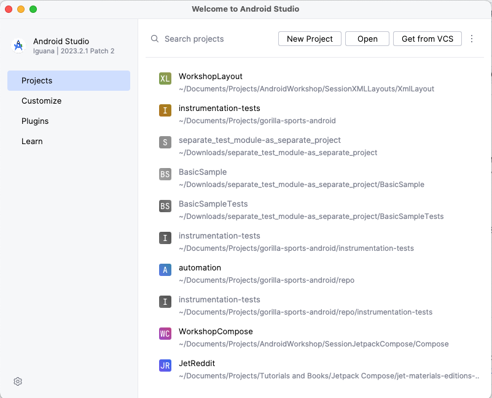
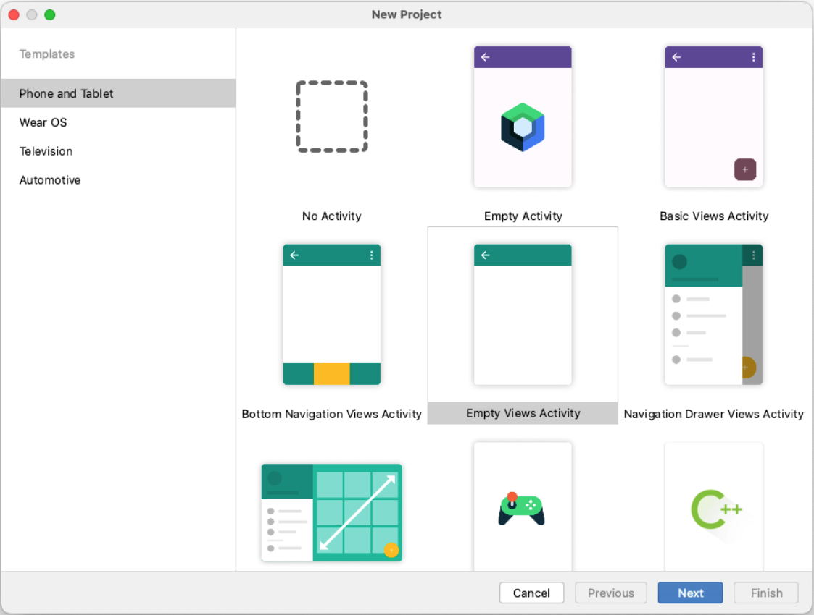
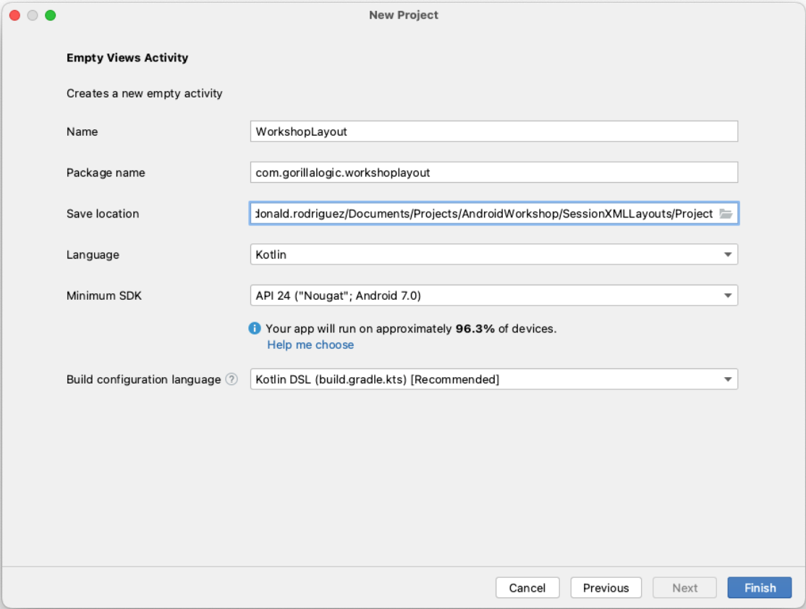

# 2. Environment preparation

## Download and Install Android Studio

If you don't have already installed Android Studio, please go to the download link at <a href="https://developer.android.com/studio" target="_blank">Android Studio</a> and follow the instructions to download and install `Android Studio` on your computer.

## Create new project

Once the installation is complete, we can create the project for the workshop following these steps:

1. Open `Android Studio`
    - If it is the first time running Android Studio, the new project template is shown by default.
    - If it is not, the welcome screen appears, in that case, select `New Project` from the top and the new  project template is shown:
     
    
     
1. In the new project template, select `Empty Views Activity` from the `Phone and Tablet` templates and select `Next`
     
     
    
     

1. In the `New project` screen, set the properties to:

    | **Property** | **Value**     |
    | ----------|-----------------|
    | Name     |  WorkshopLayout        |
    | Package     |  com.gorillalogic.workshoplayout        |
    | Save Location     |  Select a folder of your preference        |
    | Language     |  Kotlin        |

    Let the `Minimum SDK` and the `build configuration` with the default values.
    Select `Finish` and wait until the project is created and configured by `Android Studio`.
     
     
    
     
---

| [Previous: Project review](project-review.mdx) | [Next: Create Main Screen](create-main-screen.mdx) |
| :- | :- |
