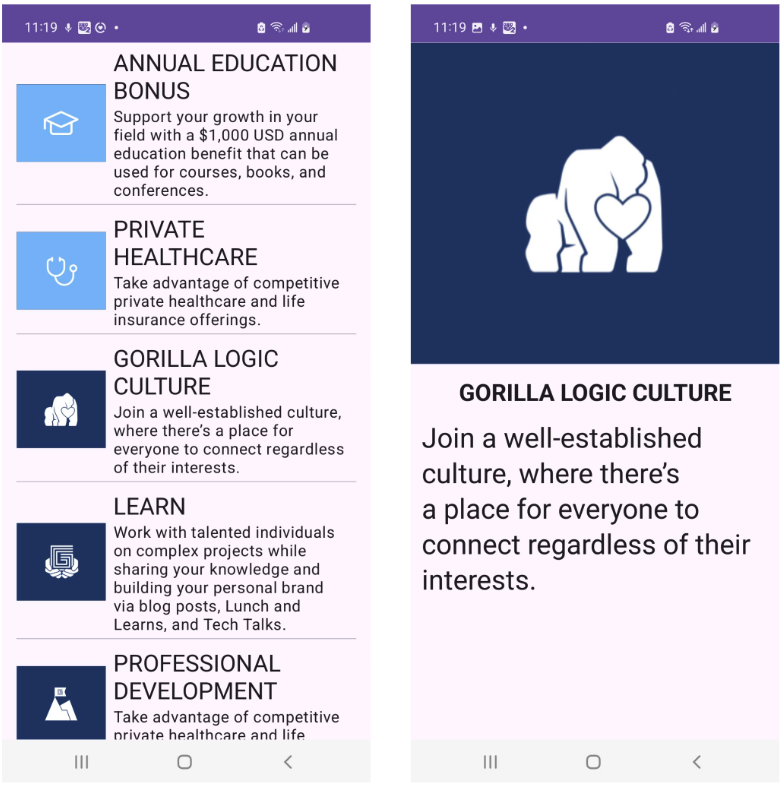
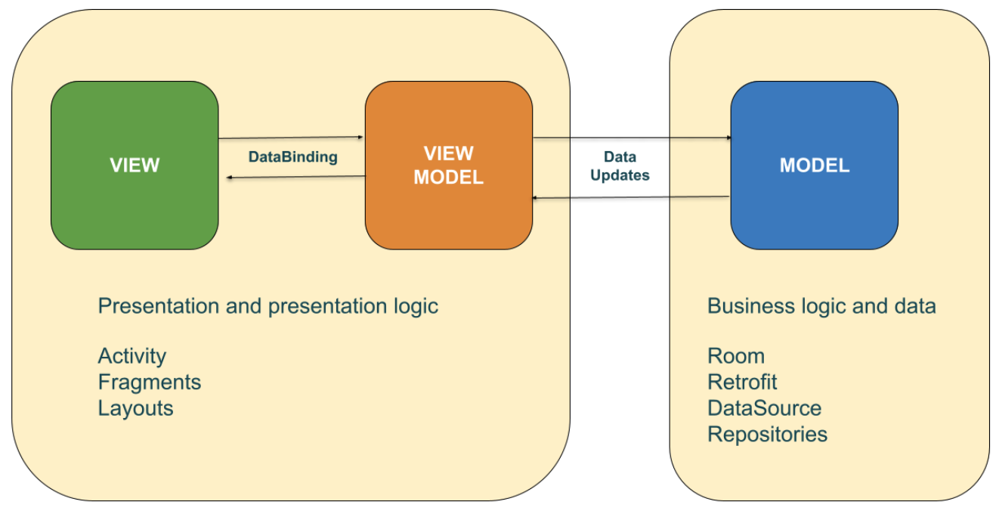

# 1. Project review

## Design and requirements

The requirements for the project are:
1. Create a screen that shows a list of items that represent the Gorilla Logic perks.
1. Each item is represented by an image, a title and a description.
1. The list must be dynamically loaded using mock data.
1. Create a detail screen showing the details of the perk selected from the main screen.
1. The app must navigate to the detail screen when the user selects one of the items in the main screen.
1. The app must come back to the main screen when the back button is pressed in the details screen.
1. The design for will be the default theme, colors and style provided by `Android Studio`

This is an example of how it should look like once completed:
 

 
## MVVM design pattern

The `Model View ViewModel` design pattern helps to separate an application's bussiness and presentation logic from the user interface.
There are three main components in the MVVM pattern, the `Model`, the `View` and the `ViewModel`. 
This diagram shows the relationship between them in an `Android Application`:

 

 

#### View

It is responsible to define the layouts and the appearance of the application `UI`. The `View` communicate to the `ViewModel` any user input or action like tapping a `Button` or typing on a `TextView`.
In Android, the `View` is handled by `Activities`, `Fragments` and the `Layout` that is inflated by them. 

#### ViewModel

The `ViewModel` implements the data binding to which the `View` can communicate to. And also notifies the `View` of any data state changes.
The `ViewModel` also communicates any data state update to and from the `Model`.
In Android, there is nativelly a robust `ViewModel` class that help us to handle this communication in an easy and clean way. 

#### Model

The `Model` classes are in charge of handling the bussiness logic and data of the application. They are typically used in conjunction with services and repositories to encapsulate data access and caching.

---

| [Next: Environment preparation](environment-preparation.mdx) |
| -:|
