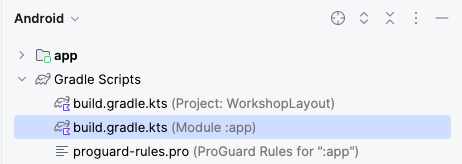

# 4. View Model

Is a business logic and screen level state holder. It exposes state to the `UI` and encapsulates related business logic. 

Its principal advantage is that it caches state and persists it through configuration changes.

## Data Source

Responsable of access, load and parse the data, it could be stored in a remote or local database a file or even mock with testing data.
<br/>
For this project, we will create a data source that create mock data:

1. Create new `package` named `datasource`
    <br/>
    <br/>
    
    <br/>

1. Inside the new `datasource` package add a new `Interface` with the name `IItemsDataSource`. 
    <br/>
    <br/>
    
    <br/>
    
    <br/>

    Replace the content of the new interface with this code:

    ```kotlin
    package com.gorillalogic.workshoplayout.datasource

    import com.gorillalogic.workshoplayout.model.ItemModel

    interface IItemsDataSource {
        suspend fun fetchItems(): List<ItemModel>
    }
    ```
    
    We are adding just one method that will be in charge of return the list of items. 
    <br/>
1. Now, create a new class inside the `datasource` package and name it `LocalItemsDataSource`. This class will implement the `IItemsDataSource` interface:
    <br/>
    <br/>
    
    <br/>
    
    Now, replace the content of the file with this code:

    ```kotlin
    package com.gorillalogic.workshoplayout.datasource

    import com.gorillalogic.workshoplayout.R
    import com.gorillalogic.workshoplayout.model.ItemModel
    import kotlinx.coroutines.Dispatchers
    import kotlinx.coroutines.withContext

    class LocalItemsDataSource : IItemsDataSource {

        //region - IItemsDataSource implementation
        override suspend fun fetchItems(): List<ItemModel> =
            withContext(Dispatchers.IO) {
                // Return local data
                return@withContext listOf<ItemModel>(
                    ItemModel(
                        R.drawable.annual_education_bonus,
                        R.string.title_annual_education_bonus,
                        R.string.desc_annual_education_bonus
                    ),
                    ItemModel(
                        R.drawable.private_healthcare,
                        R.string.title_private_healthcare,
                        R.string.desc_private_healthcare
                    ),
                    ItemModel(
                        R.drawable.gorilla_log_culture,
                        R.string.title_gorilla_logic_culture,
                        R.string.desc_gorilla_logic_culture
                    ),
                    ItemModel(
                        R.drawable.learn,
                        R.string.title_learn,
                        R.string.desc_learn
                    ),
                    ItemModel(
                        R.drawable.professional_development,
                        R.string.title_professional_development,
                        R.string.desc_professional_development
                    ),
                    ItemModel(
                        R.drawable.work_from_anywhere,
                        R.string.title_work_anywhere,
                        R.string.desc_work_anywhere
                    )
                )
            }
        //endregion
    }
    ```

    We are making an especialization of the `IItemsDataSource` interface. In our case, the `fetchItems` method will return a list of items created with local data using coroutines (so it will run on a background thread).
    <br/>
    It is important to notice that you can create any number of `IItemsDataSource` especializations to load the data from other sources like a `database` a `webservice`, etc.
    <br/>
    For more information about `Coroutines`, check the official documentation at <a href="https://developer.android.com/kotlin/coroutines" target="_blank">Coroutines</a>.

## Repository

Responsible for handling the communication between the `view model` and the `datasource`.
<br/>
Generally, it is created inside the view model and used to get and send information to and from the datasource.

1. Create new `package` named `repository`
    <br/>
    <br/>
    
    <br/>

1. Inside the new `repository` package add a new `Interface` with the name `IItemsRepository`. 
    <br/>
    <br/>
    
    <br/>

1. Now, replace the content of the file with this code::

    ```kotlin
    package com.gorillalogic.workshoplayout.repository

    import com.gorillalogic.workshoplayout.model.ItemModel

    interface IItemsRepository {
        suspend fun allItems(): List<ItemModel>
    }
    ```

1. Now, create a new class inside the `repository` package and name it `LocalItemsRepository`. 
    <br/>
    <br/>
    
    <br/>

    Replace the content with this code:

    ```kotlin
    package com.gorillalogic.workshoplayout.repository

    import com.gorillalogic.workshoplayout.datasource.IItemsDataSource
    import com.gorillalogic.workshoplayout.model.ItemModel
    import kotlinx.coroutines.Dispatchers
    import kotlinx.coroutines.withContext

    class LocalItemsRepository(
        private val dataSource: IItemsDataSource
    ) : IItemsRepository {

        //region - IItemsRepository implementation
        override suspend fun allItems(): List<ItemModel> =
            withContext(Dispatchers.IO) {
                return@withContext dataSource.fetchItems()
            }
        //endregion
    }
    ```
    This repository get a `dataSource` as parameter of type `IItemsDataSource`, that means any class that implements this interface could be send as parameter.
    <br/>
    In our case, we will send a reference of `LocalItemsDataSource` that will load the data from local resources.
    <br/>
    This implementation only have one method named `allItems` that will fetch the data from the data source using `Coroutines`.
    <br/>
## Add View Model

Responsable of handle the communication between the `UI` and the `Models`.

1. Create a new package named `view_model`:
    <br/>
    <br/>
    
    <br/>

1. Inside the new `view_model` package, create a new class named `ItemsViewModel` and replace the content with this code:

    ```kotlin
    package com.gorillalogic.workshoplayout.view_model

    import androidx.lifecycle.LiveData
    import androidx.lifecycle.MutableLiveData
    import androidx.lifecycle.ViewModel
    import androidx.lifecycle.viewModelScope
    import com.gorillalogic.workshoplayout.datasource.LocalItemsDataSource
    import com.gorillalogic.workshoplayout.model.ItemModel
    import com.gorillalogic.workshoplayout.repository.LocalItemsRepository
    import kotlinx.coroutines.Dispatchers
    import kotlinx.coroutines.launch
    import kotlinx.coroutines.withContext

    class ItemsViewModel : ViewModel() {

        //region - Properties
        private val localItemsRepository by lazy {
            LocalItemsRepository(LocalItemsDataSource())
        }

        // Store the items data
        private val _items = MutableLiveData<List<ItemModel>>()
        val items: LiveData<List<ItemModel>> = _items

        // Store the selected item data
        private val _selectedItem = MutableLiveData<ItemModel>()
        val selectedItem: LiveData<ItemModel> = _selectedItem
        //endregion

        //region - Public methods
        fun fetchItems() {
            // Make request in background thread
            viewModelScope.launch {
                val itemsData = localItemsRepository.allItems()
                // Come back to main thread
                withContext(Dispatchers.Main) {
                    _items.value = itemsData
                }
            }
        }

        fun updateSelectedItem(item: ItemModel) {
            _selectedItem.value = item
        }
        //endregion
    }
    ```

    Ok, let's review what the `ItemsViewModel` does:
    <br/>
    First, we make the view model extends the native class `ViewModel`, that give this class all the behaviour required to handle and manage states of data and relate them with the lifecycles of the app.
    <br/>
    Then, we create the `localItemsRepository` as a lazy variable (only instantiated when needed). This repository will let the view model get the data from the data source.
    <br/>
    Also, we create a mutable live data variable `items` that will store the items once they are returned by the repository.
    <br/>
    There is also the variable `selectedItem`, as the name suggest, it will keep the reference to the selected item in the main screen.
    <br/>
    Lastly we have two methods:
    <br/>
    - `fetchItems`: Will make the request to the repository to get the items data using `coroutines`.
    - `updateSelectedItem`: Will update the selected item when the user selects one in the main list.
    <br/>
    <br/>
    For more information about `Coroutines`, check the official documentation at <a href="https://developer.android.com/kotlin/coroutines" target="_blank">Coroutines</a>.
    <br/>
    And for more information about `ViewModel`, check the official documentation at <a href="https://developer.android.com/topic/libraries/architecture/viewmodel" target="_blank">View Model</a>.

# View Binding

`View Binding` is a feature that makes it easier to write code that interacts with views.
<br/>
Once a view binding is enabled in a module, it generates a binding class for each `XML` layout file present in that module. 
<br/>
An instance of a binding class contains direct references to all views that have an `ID` in the corresponding layout.
<br/>
For more information about `View Binding`, check the official documentation at <a href="https://developer.android.com/topic/libraries/view-binding" target="_blank">View Binding</a>.
<br/>
To enable view binding in our project, follow this steps:
<br/>
1. Open the `build.gradle.kts` file of the app module
    <br/>
    <br/>
    
    <br/>

1. Add this directive at the end of the `android` object:

    ```xml
    android {
        ...
        buildFeatures {
            viewBinding = true
        }
    }
    ```

1. `Sync` gradle dependencies, use the `Sync Now` button at the top right of the gradle file editor
    <br/>
    <br/>
    
    <br/>
    
1. Open the `HomeScreenFragment.kt` file and replace the code inside the `onCreateView` with this code:

    ```kotlin
    // Inflate the layout for this fragment
    val frameBinding = FragmentHomeScreenBinding.inflate(inflater, container, false)
    frameBinding.clientsRecyclerView.adapter = HomeAdapter {
        Log.d("HomeScreenFragment", "Item Selected ${getString(it.titleId)}")
    }
    return frameBinding.root
    ```
    <br/>
    You need to add this import at the top of the file:

    ```kotlin
    import com.gorillalogic.workshoplayout.databinding.FragmentHomeScreenBinding
    ```

1. Build and run the application, everything should work as it was before, the only difference is that now it is using `View Binding` instead of direct layouts.

# Data Binding

The `Data Binding` Library is a support library that allows you to bind UI components in your layouts to data sources in your app using a declarative format rather than programmatically.
<br/>
It not just binds data from code to views, it also binds views to code like `View Binding` does.
<br/>
For more information about `Data Binding`, check the official documentation at <a href="https://developer.android.com/topic/libraries/data-binding" target="_blank">Data Binding</a>.
<br/>
Let’s implement data binding in our project:
<br/>

1. Open the `Gradle` file of the module and replace the previous `viewBinding` directive to `dataBinding`:

    ```xml
    android {
        ...
        buildFeatures {
            dataBinding = true
        }
    }
    ```

1. We also need to add the `Kapt (the Kotlin Annotation Processing Tool)` plugin, it allows us to use `Java` annotation processors with `Kotlin` code, even if those processors don't have specific support for Kotlin.
    <br/>
    The plugins object is at the top of the graddle file, add this directive at the end of it

    ```kotlin
    plugins {
        ...
        id("kotlin-kapt")
    }
    ```

## Implementation

Open the main fragment layout file `res/layout/fragment_home_screen.xml` file and replace the content with this xml:

```xml
<?xml version="1.0" encoding="utf-8"?>
<layout xmlns:android="http://schemas.android.com/apk/res/android"
   xmlns:app="http://schemas.android.com/apk/res-auto"
   xmlns:tools="http://schemas.android.com/tools"
   tools:context=".home.HomeScreenFragment">

   <data>
       <variable
           name="viewModel"
           type="com.gorillalogic.workshoplayout.view_model.ItemsViewModel" />
   </data>

   <FrameLayout
       android:layout_width="match_parent"
       android:layout_height="match_parent">

       <androidx.recyclerview.widget.RecyclerView
           android:id="@+id/clients_recycler_view"
           android:layout_width="match_parent"
           android:layout_height="match_parent"
           android:scrollbars="vertical"
           app:itemsListData="@{viewModel.items}"
           app:layoutManager="androidx.recyclerview.widget.LinearLayoutManager"
           app:layout_constraintBottom_toBottomOf="parent"
           app:layout_constraintEnd_toEndOf="parent"
           app:layout_constraintStart_toStartOf="parent"
           app:layout_constraintTop_toTopOf="parent"
           tools:itemCount="20"
           tools:listitem="@layout/home_item" />

   </FrameLayout>
   
</layout>
```

Here we are adding a new `layout` node that will encapsulate all the design.
<br/>
We are also adding a variable to the binding layout named `viewModel`, this variable is a reference for the `ItemsViewModel`.
<br/>

## Binding Adapters

A `binding adapter` is a feature that allows us to declare in `xml layout` what property of the `view model` we want to use to set the values or characteristics of UI components.
<br/>
Let’s implement the binding adapter for the items of the home screen:
<br/>
1. Create new package named `utils`:
    <br/>
    <br/>
    
    <br/>

1. Inside the package `utils`, create a new file named `BindingAdapter` and replace the contents with this code:

    ```kotlin
    package com.gorillalogic.workshoplayout.utils

    import androidx.databinding.BindingAdapter
    import androidx.recyclerview.widget.RecyclerView
    import com.gorillalogic.workshoplayout.home.HomeAdapter
    import com.gorillalogic.workshoplayout.model.ItemModel

    @BindingAdapter("itemsListData")
    fun bindItemsRecyclerView(recyclerView: RecyclerView, data: List<ItemModel>?) {
        val adapter = recyclerView.adapter as HomeAdapter
        adapter.submitList(data)
    }
    ```

    What we are doing here is creating a `binding adapter` that will get the `recyclerView` and the list of items we want to add to it.
    <br/>
    The binding adapter will set the list of the adapter with the data sent by parameter.
    <br/>

1. Open the home screen fragment layout (`fragment_home_screen.xml`) and add the binding adapter inside the `RecyclerView` declaration:

    ```xml
    app:itemsListData="@{viewModel.items}"
    ```

1. Now, open the `HomeScreenFragment.kt` file and add this new property at the top of the class declaration:

    ```kotlin
    //region - Properties
    private val itemsViewModel: ItemsViewModel by activityViewModels()
    //endregion
    ```

1.  Remove the `onViewCreated` methodm, it is not needed anymore

1. We need to allow data binding to `observe` the life cycle of the `fragment` and give the data binding access to the view model. 
    <br/>
    Add these lines of code right after the declaration of the `frameBinding` in the `onCreateView` method:

    ```kotlin
    frameBinding.apply {
        // Allows Data Binding to Observe LiveData with the lifecycle of this Fragment
        lifecycleOwner = viewLifecycleOwner
        // Giving the binding access to the ViewModel
        viewModel = itemsViewModel
    }
    ```

1. Build and run the application, it should work as expected without any error.

---

| [Previous: Create Main Screen](create-main-screen.mdx) | [Next: Create Details Screen](create-details-screen.mdx) |
| :- | :- |