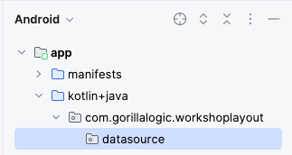
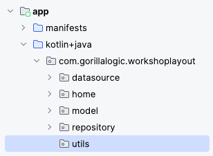

# 4. View Model

Is a business logic and screen level state holder. It exposes state to the `UI` and encapsulates related business logic. 

Its principal advantage is that it caches state and persists it through configuration changes.

## Data Source

Responsable of access, load and parse the data, it could be stored in a remote or local database a file or even mock with testing data.

For this project, we will create a data source that create mock data:

1. Create new `package` named `datasource`
    <br/>
    <br/>
    
    <br/>

1. Inside the new `datasource` package add a new `Interface` with the name `IItemsDataSource`. Add this code to the body of the interface:

    ```kotlin
    suspend fun fetchItems(): List<ItemModel>
    ```

1. Now, create a new class inside the `datasource` package and name it `LocalItemsDataSource`. This class will implement the `IItemsDataSource` interface:

    ```kotlin
    class LocalItemsDataSource: IItemsDataSource {
    ```

1. Finally, add the `IItemsDataSource` implementation:

    ```kotlin
    //region - IItemsDataSource implementation
    override suspend fun fetchItems(): List<ItemModel> =
        withContext(Dispatchers.IO) {
            val itemsList = listOf(
                ItemModel(
                    R.drawable.annual_education_bonus,
                    R.string.title_annual_education_bonus,
                    R.string.desc_annual_education_bonus
                ),
                ItemModel(
                    R.drawable.private_healthcare,
                    R.string.title_private_healthcare,
                    R.string.desc_private_healthcare
                ),
                ItemModel(
                    R.drawable.gorilla_log_culture,
                    R.string.title_gorilla_logic_culture,
                    R.string.desc_gorilla_logic_culture
                ),
                ItemModel(
                    R.drawable.learn,
                    R.string.title_learn,
                    R.string.desc_learn
                ),
                ItemModel(
                    R.drawable.professional_development,
                    R.string.title_professional_development,
                    R.string.desc_professional_development
                ),
                ItemModel(
                    R.drawable.work_from_anywhere,
                    R.string.title_work_anywhere,
                    R.string.desc_work_anywhere
                )
            )
            // Return local data
            return@withContext itemsList
        }
    //endregion
    ```

## Repository

Responsible for handling the communication between the `view model` and the `datasource`.

Generally, it is created inside the view model and used to get and send information to and from the datasource.

1. Create new `package` named `repository`
    <br/>
    <br/>
    
    <br/>

1. Inside the new `repository` package add a new `Interface` with the name `IItemsRepository`. Add this code to the body of the interface:

    ```kotlin
    suspend fun allItems(): List<ItemModel>
    ```

1. Now, create a new class inside the `repository` package and name it `LocalItemsRepository`. This class will implement the `IItemsRepository` interface:

    ```kotlin
    class LocalItemsRepository(
        private val dataSource: IItemsDataSource
    ): IItemsRepository {

        //region - IItemsRepository implementation
        override suspend fun allItems(): List<ItemModel> =
            withContext(Dispatchers.IO) {
                return@withContext dataSource.fetchItems()
            }
        //endregion
    }
    ```

## Add View Model

Responsable of handle the communication between the `UI` and the `Models`.

1. Create a new package named `view_model`:
    <br/>
    <br/>
    
    <br/>

1. Inside the new `view_model` package, create a new class named `ItemsViewModel`. 
    
    Replace the class implementation with this code:

    ```kotlin
    class ItemsViewModel: ViewModel() {
        
        //region - Properties
        private val localItemsRepository by lazy {
            LocalItemsRepository(LocalItemsDataSource())
        }
        // Store the items data
        private val _items = MutableLiveData<List<ItemModel>>()
        val items: LiveData<List<ItemModel>> = _items
        // Store the selected item data
        private val _selectedItem = MutableLiveData<ItemModel>()
        val selectedItem: LiveData<ItemModel> = _selectedItem
        //endregion

        //region - Public methods
        fun fetchItems() {
            // Make request in background thread
            viewModelScope.launch {
                val itemsData = localItemsRepository.allItems()
                // Come back to main thread
                withContext(Dispatchers.Main) {
                    _items.value = itemsData
                }
            }
        }

        fun updateSelectedItem(item: ItemModel) {
            _selectedItem.value = item
        }
        //endregion
    }
    ```

# Implementing View Model

1. Open the `HomeScreenFragment` and add this new property:

    ```kotlin
    //region - Properties
    private val itemsViewModel: ItemsViewModel by activityViewModels()
    //endregion
    ```

2. In the `onViewCreated` method, at the end, use the view model to fetch the items data:

    ```kotlin
    // Fetch items data
    itemsViewModel.fetchItems()
    ```

# View Binding

`View Binding` is a feature that makes it easier to write code that interacts with views. Once a view binding is enabled in a module, it generates a binding class for each `XML` layout file present in that module. 

An instance of a binding class contains direct references to all views that have an `ID` in the corresponding layout.

Enable view binding:

1. Open the `Gradle` file of the module and add this directive inside the android object and `sync Gradle`:

    ```xml
    android {
        ...
        buildFeatures {
            viewBinding = true
        }
    }
    ```

1. Open the `HomeScreenFragment.kt` file and replace the code inside the `onCreateView` with this code:

    ```kotlin
    // Inflate the layout for this fragment
    val frameBinding = FragmentHomeScreenBinding.inflate(inflater, container, false)
    frameBinding.clientsRecyclerView.adapter = HomeAdapter {
        Log.d("HomeScreenFragment", "Item Selected ${getString(it.titleId)}")
    }
    return frameBinding.root
    ```

1. Build and run the application, everything should work as it was before the `view binding` implementation, the only difference is that now it is using `View Binding`.

# Data Binding

The `Data Binding` Library is a support library that allows you to bind UI components in your layouts to data sources in your app using a declarative format rather than programmatically.

It not just binds data from code to views, it also binds views to code like `View Binding`.

Let’s implement data binding in our project:

1. Open the `Gradle` file of the module and replace the previous `viewBinding` directive to `dataBinding`:

    ```xml
    android {
        ...
        buildFeatures {
            dataBinding = true
        }
    }
    ```

1. We also need to add the `Kapt (the Kotlin Annotation Processing Tool)` plugin, it allows us to use `Java` annotation processors with `Kotlin` code, even if those processors don't have specific support for Kotlin.

    ```kotlin
    id("kotlin-kapt")
    ```

1. Build and try to run the project, you should see some errors in the `HomeScreenFragment.kt` file

## Implementation

Open the `fragment_home_screen.xml` file and replace the content with this xml:

```xml
<?xml version="1.0" encoding="utf-8"?>
<layout xmlns:android="http://schemas.android.com/apk/res/android"
   xmlns:app="http://schemas.android.com/apk/res-auto"
   xmlns:tools="http://schemas.android.com/tools"
   tools:context=".home.HomeScreenFragment">

   <data>
       <variable
           name="viewModel"
           type="com.gorillalogic.workshoplayout.view_model.ItemsViewModel" />
   </data>

   <FrameLayout
       android:layout_width="match_parent"
       android:layout_height="match_parent">

       <androidx.recyclerview.widget.RecyclerView
           android:id="@+id/clients_recycler_view"
           android:layout_width="match_parent"
           android:layout_height="match_parent"
           android:scrollbars="vertical"
           app:layoutManager="androidx.recyclerview.widget.LinearLayoutManager"
           app:layout_constraintBottom_toBottomOf="parent"
           app:layout_constraintEnd_toEndOf="parent"
           app:layout_constraintStart_toStartOf="parent"
           app:layout_constraintTop_toTopOf="parent"
           tools:itemCount="20"
           tools:listitem="@layout/home_item" />

   </FrameLayout>
   
</layout>

```

## Binding Adapters

A `binding adapter` is a feature that allows us to declare in `xml layout` what property of the `view model` we want to use to set the values or characteristics of UI components.

Let’s implement the binding adapter of the items of the home screen:

1. Create new package named `utils`:
    <br/>
    <br/>
    
    <br/>

1. Inside the package `utils`, create a new file named `BindingAdapter` and add this code to it:

    ```kotlin
    @BindingAdapter("itemsListData")
    fun bindItemsRecyclerView(recyclerView: RecyclerView, data: List<ItemModel>?) {
        val adapter = recyclerView.adapter as HomeAdapter
        adapter.submitList(data)
    }
    ```

1. Open the home screen fragment layout (`fragment_home_screen.xml`) and add this line of code inside the `RecyclerView` declaration:

    ```xml
    app:itemsListData="@{itemsViewModel.items}"
    ```

1. Open the `HomeScreenFragment.kt` file and remove the code in the `onViewCreated` method that setup the list of items in the `adapter`:

    ```kotlin
    val recyclerView = view.findViewById<RecyclerView>(
        R.id.clients_recycler_view
    )
    val adapter = recyclerView.adapter as HomeAdapter
    adapter.submitList(ItemModel.randomItems())
    recyclerView.adapter
    ```

1. We need to allow data binding to `observe` the life cycle of the `fragment` and give the data binding access to the view model. 

Add these lines of code right after the declaration of the `frameBinding` in the `onCreateView` method:

    ```kotlin
    binding.apply {
        // Allows Data Binding to Observe LiveData with the lifecycle of this Fragment
        lifecycleOwner = viewLifecycleOwner
        // Giving the binding access to the ViewModel
        viewModel = itemsViewModel
    }
    ```

1. Build and run the application, it should work as expected without any error.

---

| [Previous: Create Main Screen](create-main-screen.mdx) | [Next: Create Details Screen](create-details-screen.mdx) |
| :- | :- |
